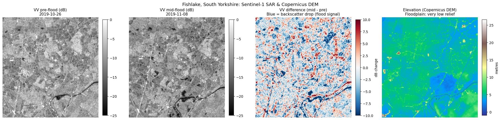
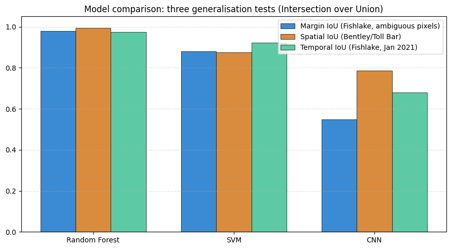
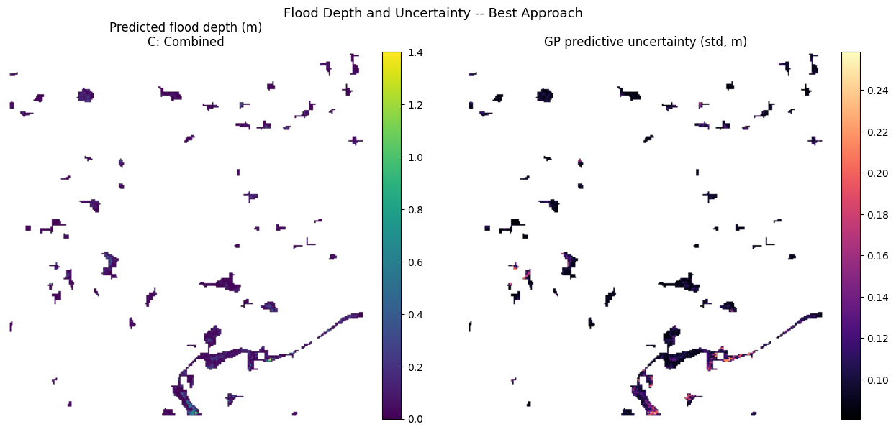

# Multi-Sensor Machine Learning for Flood Characterisation in South Yorkshire: Extent and Depth

 
*Figure 1: Four-panel visualisation of Sentinel-1 SAR data for Fishlake, 2019, and a Copernicus elevation DEM for the same site.*

## Project Description

Flooding is one of the most frequent and costly natural hazards in the United Kingdom, and its severity, spatial extent, and return frequencies are projected to escalate under a warming climate. Between 7th and 10th November 2019, exceptional meteorological conditions drove the River Don at Doncaster (South Yorkshire) to its highest recorded level of over 6.3, eclipsing the historic 2007 benchmark. According to Doncaster Council's subsequent flood investigation, this extreme event directly inundated 897 properties across the borough, with the low-lying village of Fishlake among the worst hit.

While rapid, accurate mapping is vital for emergency response and protection of infrastructure, traditional ground-based gauges and aerial surveys are constrained by high operational costs, spatial discontinuity, and physical hazards during an active disaster. Remote sensing combined with machine learning offers a scalable, objective alternative. Synthetic Aperture Radar (SAR) can image flooded ground through cloud cover and at night during the peak of an event, while optical sensors offer high-resolution multispectral reflectance data capturing water quality and depth data once cloud cover clears. 

---

### 1. Structure:

* **Notebook 1: Data Acquisition**
    * Ingested Sentinel-1 SAR GRD Pair (Pre-flood vs. Mid-flood: Nov 2019 / Jan 2021)
    * Processed Copernicus 30m DEM (Elevation & Derived Slope Features)
    * Retrieved Sentinel-2 MSI Multispectral Data (Cloud-free Post-flood: 18 Nov 2019)
    

* **Notebook 2: Semi-Supervised Classification & Spatial/Temporal Generalisation**
    * Split Training Scene: Separated into Confident Core (used for training labels) and Ambiguous Margin (retained for validating baseline circularity)
    * Classifier Implementations: Trained Random Forest, Support Vector Machine (SVM), and a patch-based 2D CNN on the Confident Core
    * Out-of-Sample Evaluations: Compared performance against independent, localized Change-Detection Baselines:
        * *Spatial Generalisation:* Evaluated on the Bentley / Toll Bar scene (Nov 2019)
        * *Temporal Generalisation:* Evaluated on the Fishlake AOI scene (Jan 2021)

* **Notebook 3: Multimodal Depth Regression & Explainable AI (XAI)**
    * Target Engineering: Computed a HAND-Style Proxy Target tracking the height differential between flooded pixels and the nearest dry boundary elements
    * Gaussian Process (GP) Regression with an ARD Kernel:
        * *Approach A:* Evaluated SAR Backscatter + Terrain Features
        * *Approach B:* Evaluated Sentinel-2 Multispectral Reflectance + Water Indices
        * *Approach C:* Evaluated the Multimodal Combined Feature Space
    * Validation Cross-Checks: Unsupervised K-Means Clustering on reflectance indices and Global Feature Attribution via SHAP analysis on a Random Forest Regressor

---

**Flood Extent Detection**: To bypass the circular logic of training an AI model to copy an empirical threshold baseline, classifiers were trained exclusively on a Confident Core of pixels. Their capacity to learn real physical signals was challenged by predicting the unlabelled Ambiguous Margin and independent scenes.

 
*Figure 9: An overall model comparison of 'Intersection over Union' (our accuracy measurement) for Margin pixels, Spatial Testing (Bentley/Toll Bar), and Temporal Testing (Fishlake Jan 2021).*

**Multimodal Flood Depth Estimation**: Because satellite backscatter highlights water location rather than volume, we evaluated how effectively remote sensing data can predict a terrain-derived depth proxy across a flat floodplain.

 
*Figure 14: Full depth and uncertainty map for best approach: Combined (C) using SAR + terrain AND optical.*

**See the [Project Notebooks](Project_Notebooks/) and [README](README.md) for a more extensive description of methodology.**

---

### 2. Project Limitations:

- Validation Limits of the Depth Proxy: A primary constraint is the reliance on an unvalidated, HAND-style elevation proxy rather than true hydrodynamic measurements. While topographically logical, this proxy assumes a uniform horizontal flood plane. It cannot capture localized variations driven by surface obstacles, micro-topography, or urban defenses.

- Topographic Constraints on Fluvial Floodplains: The extreme flatness of the South Yorkshire floodplain limits the predictive value of elevation data. Because minor variations in elevation correspond to large changes in surface area, the depth proxy concentrates close to zero. This constraint explains the low $R^2$ metrics and indicates that these depth estimation models may perform differently in high-relief valleys.

- Temporal Mismatch in Sensor Fusion: The Sentinel-2 optical scene was captured on 18 November 2019, roughly ten days after the mid-flood Sentinel-1 SAR acquisition at the peak of the event. This delay was unavoidable due to persistent cloud cover during the storm. Consequently, the optical data captures a receding flood stage with different turbidity profiles, meaning the combined model is fusing two separate points in time.

- Temporal Resolution Constraints: The project relies on single image pairs, capturing static snapshots rather than the full flood hydrograph. While out-of-sample tests partially demonstrate spatial and temporal transferability, they cannot track how depth or extent evolve dynamically within a single event.

### 3. Reference List:

* Doncaster Council (2020). Section 19 Flood Investigation Report: November 2019 Flood Event. Flood Risk Management Team. https://www.doncaster.gov.uk/services/emergencies/flood-recovery-report.

* Lundberg, S. M., & Lee, S.-I. (2017). A unified approach to interpreting model predictions. Advances in Neural Information Processing Systems, 30, 4765–4774. https://doi.org/10.48550/arXiv.1705.07874.

* McFeeters, S. K. (1996). The use of the Normalized Difference Water Index (NDWI) in the delineation of open water features. International Journal of Remote Sensing, 17(7), 1425–1432. https://doi.org/10.1080/01431169608948714

* Rasmussen, C. E., & Williams, C. K. I. (2006). Gaussian Processes for Machine Learning. MIT Press. https://gaussianprocess.org/gpml/chapters/RW.pdf.

* Rennó, C. D., Nobre, A. D., Cuartas, L. A., Soares, J. V., Hodnett, M. G., Tomasella, J., & Waterloo, M. W. (2008). HAND, a new terrain descriptor using SRTM-DEM: Mapping terra-firme rainforest environments in Amazonia. Remote Sensing of Environment, 112(9), 3469–3481. https://doi.org/10.1016/j.rse.2008.03.018

* Roberts, D. R., Bahn, V., Ciuti, S., Boyce, M. S., Elith, J., Guillera-Arroita, G., Hauenstein, S., Lahoz-Monfort, J. J., Schröder, B., Thuiller, W., Warton, D. I., Wintle, B. A., Hartig, F., & Dormann, C. F. (2017). Cross-validation strategies for data with temporal, spatial, hierarchical, or phylogenetic structure. Ecography, 40(8), 913–929. https://doi.org/10.1111/ecog.02881

* Stumpf, R. P., Holderied, K., & Sinclair, M. (2003). Determination of water depth with high-resolution satellite imagery over variable substrates. Limnology and Oceanography, 48(1_part_2), 547–556. https://doi.org/10.4319/lo.2003.48.1_part_2.0547

* Tupas, M. E., Roth, F., Bauer-Marschallinger, B., & Wagner, W. (2023). An intercomparison of Sentinel-1 based change detection algorithms for flood mapping. Remote Sensing, 15(5), 1200. https://doi.org/10.3390/rs15051200

* Xu, H. (2006). Modification of normalised difference water index (NDWI) to enhance open water features in noise‐free multispectral imagery. International Journal of Remote Sensing, 27(14), 3025–3033. https://doi.org/10.1080/01431160600589179
