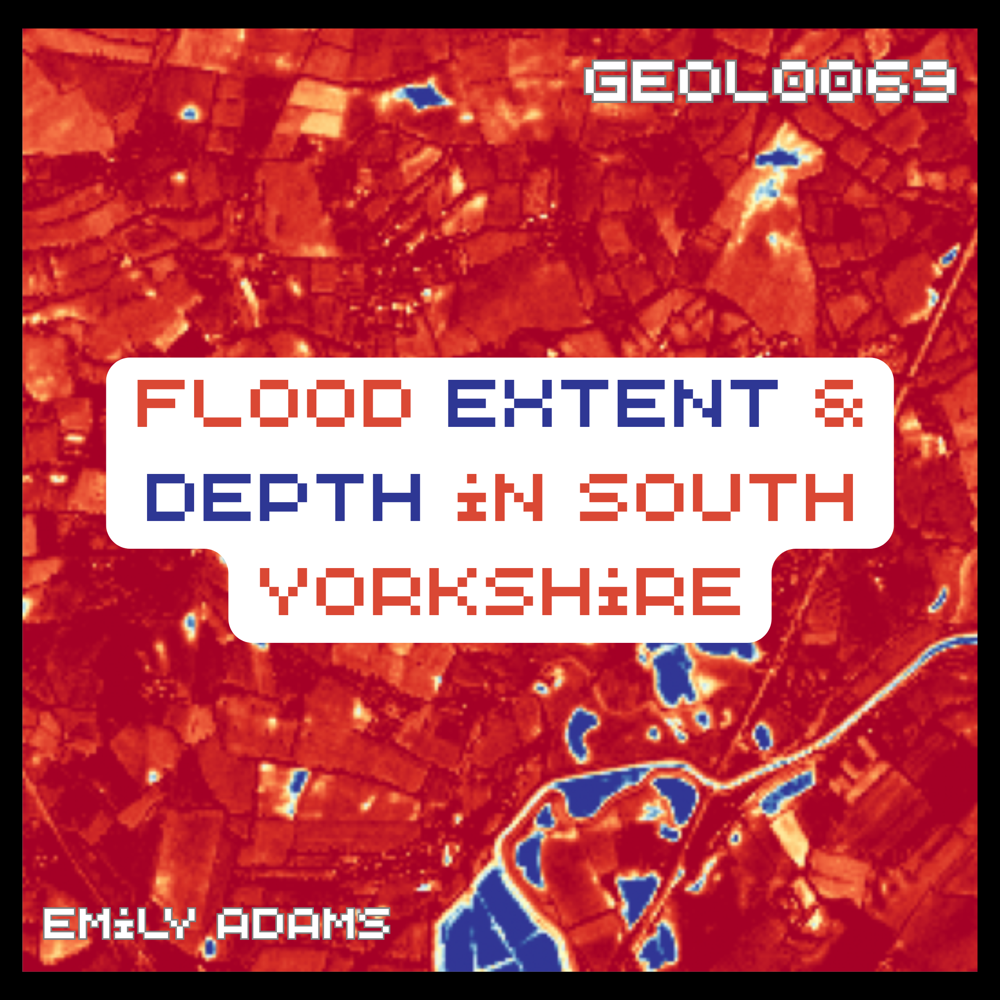

<a name="readme-top"></a>

<div align="center">
  <a href="https://github.com/eemeleems/GEOL0069_Project_FloodDetection">
    
  </a>

  <h3 align="center">Flood Extent Mapping and Depth Estimation from Sentinel-1/2</h3>

  <p align="center">
    SAR change detection, supervised generalisation testing, and explainable GP depth regression for the November 2019 South Yorkshire floods
    <br />
    <strong>GEOL0069 (AI4EO) - Final Project | UCL Earth Sciences</strong>
    <br />
    <a href="PROJECT_DESCRIPTION.md"><strong>Explore the project description »</strong></a>
    <br />
    <br />
    <a href="https://www.youtube.com/watch?v=YOUR-VIDEO-ID">Watch the video walkthrough</a>
    ·
    <a href="Project_Notebooks/">View the notebooks</a>
    ·
    <a href="ENVIRONMENTAL_COST.md">Environmental cost</a>
  </p>
</div>

<details>
  <summary>Table of Contents</summary>
  <ol>
    <li><a href="#about-the-project">About The Project</a>
      <ul>
        <li><a href="#research-questions">Research Questions</a></li>
        <li><a href="#built-with">Built With</a></li>
      </ul>
    </li>
    <li><a href="#repository-structure">Repository Structure</a></li>
    <li><a href="#notebooks-overview">Notebooks Overview</a></li>
    <li><a href="#key-results">Key Results</a></li>
    <li><a href="#getting-started">Getting Started</a>
      <ul>
        <li><a href="#prerequisites">Prerequisites</a></li>
        <li><a href="#installation">Installation</a></li>
      </ul>
    </li>
    <li><a href="#environmental-cost">Environmental Cost</a></li>
    <li><a href="#project-report--video">Project Report & Video</a></li>
    <li><a href="#references">References</a></li>
    <li><a href="#contact">Contact</a></li>
    <li><a href="#acknowledgments">Acknowledgments</a></li>
    <li><a href="#license">License</a></li>
  </ol>
</details>

## About The Project

In November 2019, an exceptional meteorological event dropped a month's worth of rainfall over South Yorkshire in 24 hours. The River Don breached its banks, severely flooding the village of Fishlake and damaging approximately 1,600 regional properties.

This repository presents a machine learning pipeline addressing two central challenges in satellite-based disaster response:
1. **Flood Extent Detection:** Optimising microwave backscatter properties from Sentinel-1 Synthetic Aperture Radar (SAR).
2. **Flood Depth Estimation:** Developing topographically driven regressions via data fusion of SAR, Sentinel-2 multispectral optical indices, and Digital Elevation Models (DEM).

Rather than validating models on a single scene, this framework enforces a strict out-of-sample layout across three targeted locations to isolate genuine spatial and temporal generalisation from simple pixel memorisation:
* **Training Scene:** Fishlake, November 2019 (Peak flood event).
* **Spatial Test Scene:** Bentley / Toll Bar, November 2019 (Same storm event, distinct floodplain characteristics).
* **Temporal Test Scene:** Fishlake, January 2021 (Storm Christoph – same geographic coordinate, different environmental preconditions and flood boundaries).

<br />
<br />
<div align="center">
  
  <br />
  <br />
  <p><em>Infographic: Overview of the Sentinel-1 SAR instrument and application to flood-mapping.</em></p>
</div>

### Research Questions

1. Do machine learning classifiers (Random Forest, SVM, CNN) trained on a change-detection backscatter threshold baseline extract underlying physical indicators that generalise across space and time, or do they simply mirror the empirical rule they were given?
2. Does the integration of post-flood optical water-colour indices provide complementary insights for flood depth estimation over a flat floodplain compared to standard terrain-derived proxies alone? Which spectral features are most informative?

### Built With

* **Core Platforms:** [Google Earth Engine](https://earthengine.google.com/) & [geemap](https://geemap.org/)
* **Sensors:** [Sentinel-1 (SAR)](https://sentiwiki.copernicus.eu/web/s1-mission) & [Sentinel-2 (MSI)](https://sentiwiki.copernicus.eu/web/s2-mission) via the Copernicus programme
* **Data & Terrain:** Copernicus 30 m Global DEM
* **Machine Learning:** `scikit-learn` (Random Forest, SVM, Gaussian Process Regression with ARD)
* **Deep Learning:** `TensorFlow` / `Keras` (Patch-based 2D Convolutional Neural Network)
* **Explainable AI (XAI) & Tracking:** `SHAP` & `CodeCarbon`

<p align="right">(<a href="#readme-top">back to top</a>)</p>

## Repository Structure

```
GEOL0069_Project_FloodDetection/
├── README.md                     <- Primary landing page & project overview
├── PROJECT_DESCRIPTION.md        <- Introduction to the problem
├── ENVIRONMENTAL_COST.md         <- Emissions tracking & analysis
├── Sentinel1_INFOGRAPHIC.png
├── LICENSE
├── Project_Notebooks/
│   ├── Flood_Notebook1_DataAcquisition.ipynb     <- SAR/DEM/S2 acquisition + threshold baseline
│   ├── Flood_Notebook2_Classification.ipynb      <- RF / SVM / CNN + generalisation tests
│   └── Flood_Notebook3_Regression_XAI.ipynb      <- depth proxy, GP regression, ARD, SHAP
└── images/
    ├── LOGO_README.png                 
    └── Project Photos
```

<p align="right">(<a href="#readme-top">back to top</a>)</p>

## Notebooks Overview

| Notebook | Content |
|---|---|
| **1. Data Acquisition** | Fetches Sentinel-1 SAR (pre/mid-flood), Copernicus DEM, and Sentinel-2 optical imagery via Earth Engine for all three scenes. Computes an independent SAR change-detection **Threshold Baseline** flood map for each scene, used throughout the project as a reference rather than ground truth. |
| **2. Classification** | Splits the training scene into a confident core and an ambiguous margin to avoid label circularity, then trains Random Forest, SVM, and a CNN on the confident core. Evaluates all three against the Threshold Baseline on the ambiguous margin (in-scene), the spatial test scene, and the temporal test scene. |
| **3. Regression & XAI** | Defines a DEM-based relative depth proxy, computes Sentinel-2 water-colour indices (NDWI, MNDWI, Stumpf ratio), and compares three Gaussian Process regression approaches (SAR+terrain, optical, combined) using ARD lengthscales for interpretation. Cross-checks with K-means clustering and SHAP, and discusses the project's environmental footprint. |

<p align="right">(<a href="#readme-top">back to top</a>)</p>

## Key Results

* **Classification generalisation**: Random Forest generalised most consistently across all three evaluation axes (Margin IoU 0.980, Spatial IoU 0.994, Temporal IoU 0.974), consistent with learning something close to the underlying SAR threshold rule rather than scene-specific texture. The CNN generalised worst and, notably, dropped further on the temporal test than the spatial one, suggesting some reliance on acquisition-specific SAR texture rather than a fully transferable flood signal.
* **Depth regression**: combining SAR/terrain and optical features gave the best held-out performance (R² = 0.186), against 0.173 for SAR+terrain alone and 0.112 for optical alone - a real but modest improvement, limited by how flat the floodplain is relative to the resolution of the depth proxy.
* **Explainability**: ARD lengthscales and SHAP partially agree on which features matter (elevation and water-colour indices both feature prominently) but disagree on the specific ranking, illustrating that two reasonable XAI methods applied to related models don't always tell the same story.


<p align="right">(<a href="#readme-top">back to top</a>)</p>

## Getting Started

### Prerequisites

* A Google account with [Earth Engine access](https://signup.earthengine.google.com/) enabled (required for Notebook 1's data acquisition).
* Python 3.10+ if running locally, or just a Google account if running in [Google Colab](https://colab.research.google.com/) (recommended - this is how the notebooks were developed and tested).

### Installation

If running in Google Colab, only the packages not already in the Colab runtime need installing - this is handled by the `!pip install` cells at the top of each notebook:

```bash
pip install geemap shap codecarbon -q
```

If running locally, install everything from `requirements.txt`:

```bash
git clone https://github.com/eemeleems/GEOL0069_Project_FloodDetection.git
cd GEOL0069_Project_FloodDetection
pip install -r requirements.txt
```

Each notebook is self-contained and should be run in order (1 → 2 → 3), since Notebooks 2 and 3 load the feature stack saved by the previous notebook.

<p align="right">(<a href="#readme-top">back to top</a>)</p>

## Environmental Cost

Every model trained in Notebooks 2 and 3 is tracked with [CodeCarbon](https://codecarbon.io/), and the resulting energy and CO2 figures are discussed in context - alongside the UK grid carbon intensity and the broader footprint of AI/data-centre electricity demand - in [`ENVIRONMENTAL_COST.md`](ENVIRONMENTAL_COST.md).

<p align="right">(<a href="#readme-top">back to top</a>)</p>

## Project Report & Video

* A short video walkthrough explaining the code and approach is available here: **[Watch on YouTube](https://www.youtube.com/watch?v=YOUR-VIDEO-ID)**.

<p align="right">(<a href="#readme-top">back to top</a>)</p>

## References

* Sefton, C., Muchan, K., Parry, S., Matthews, B., Barker, L., Turner, S. and Hannaford, J. (2021), The 2019/2020 floods in the UK: a hydrological appraisal. *Weather*, 76: 378-384. [doi.org/10.1002/wea.3993](https://doi.org/10.1002/wea.3993)
* UN-SPIDER Knowledge Portal, [Recommended Practice: Flood Mapping and Damage Assessment Using Sentinel-1 SAR Data in Google Earth Engine](https://un-spider.org/advisory-support/recommended-practices/recommended-practice-google-earth-engine-flood-mapping/step-by-step)
* McFeeters, S.K. (1996), The use of the Normalized Difference Water Index (NDWI) in the delineation of open water features. *International Journal of Remote Sensing*, 17(7), 1425-1432. [doi.org/10.1080/01431169608948714](https://doi.org/10.1080/01431169608948714)
* Xu, H. (2006), Modification of normalised difference water index (NDWI) to enhance open water features in remotely sensed imagery. *International Journal of Remote Sensing*, 27(14), 3025-3033. [doi.org/10.1080/01431160600589179](https://doi.org/10.1080/01431160600589179)
* Stumpf, R.P., Holderied, K. and Sinclair, M. (2003), Determination of water depth with high-resolution satellite imagery over variable bottom types. *Limnology and Oceanography*, 48(1), 547-556. [doi.org/10.4319/lo.2003.48.1_part_2.0547](https://doi.org/10.4319/lo.2003.48.1_part_2.0547)
* UK Department for Energy Security and Net Zero (DESNZ), [Greenhouse gas reporting: conversion factors 2024](https://www.gov.uk/government/publications/greenhouse-gas-reporting-conversion-factors-2024)
* International Energy Agency (2024), [Energy demand from AI](https://www.iea.org/reports/energy-and-ai/energy-demand-from-ai)

<p align="right">(<a href="#readme-top">back to top</a>)</p>

## Contact

Emily Grace Adams - [LinkedIn](https://www.linkedin.com/in/emily-grace-adams/) - emily.adams.25@ucl.ac.uk

Project Link: [https://github.com/eemeleems/GEOL0069_Project_FloodDetection](https://github.com/YOUR-USERNAME/GEOL0069_Project_FloodDetection)

<p align="right">(<a href="#readme-top">back to top</a>)</p>

## Acknowledgments

* This project is the final assignment for GEOL0069 Artificial Intelligence for Earth Observation (25/26) at University College London.
* Thank you to [Prof. Michel Tsamados](https://profiles.ucl.ac.uk/11855-michel-tsamados), ([Weibin Chen](https://www.ucl.ac.uk/mathematical-physical-sciences/weibin-chen) and [Shambu Bhandari Sharma](https://www.ucl.ac.uk/mathematical-physical-sciences/earth-sciences/people/research-students/shambhu-bhandari-sharma) for the GEOL0069 module content and guidance this project builds on.
* Thank you to [ESA/Copernicus](https://www.copernicus.eu/en) for the availability of Sentinel-1 and Sentinel-2 data, and to Google Earth Engine for the processing platform.
* [Best-README-Template](https://github.com/othneildrew/Best-README-Template), on which this README's structure is based.

<p align="right">(<a href="#readme-top">back to top</a>)</p>

## License

Distributed under the MIT License. See [`LICENSE`](LICENSE) for more information.

<p align="right">(<a href="#readme-top">back to top</a>)</p>
